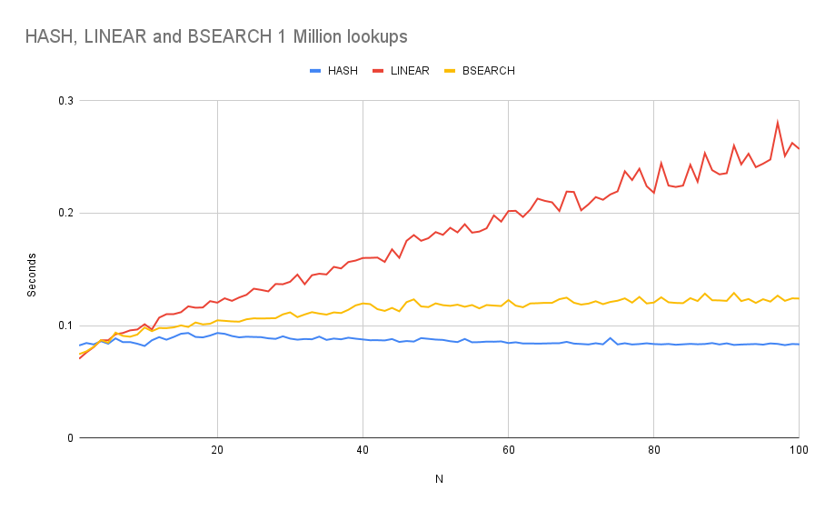

# Are Hashmaps Worth it

A simple experiment on my machine to find at what point a string lookup is better
with a hash map compared to a linear search. The data also includes binary search just for fun.

# Hypothesis

My initial hypothesis was that the point hash maps become better would be approximately when the set size
is equal to the key length. This is mainly because the hash function must process each byte of a key, while
a linear lookup must only process the prefix.

# Methodology

Create a hash table and list with N 8 byte keys, perform 1 million random lookups and plot results.

See run-experiment.sh and main.c for code.

# Results

# Conclusions

The hypothesis seemed to be approximately right, but I wouldn't draw any conclusions or take it seriously.

